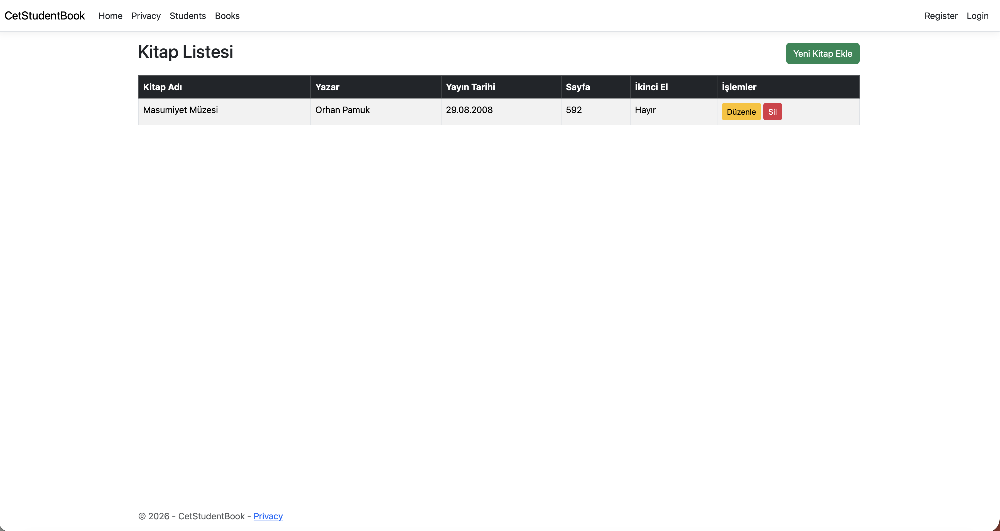

# Assignment: Books CRUD

Bu proje, ASP.NET Core MVC kullanılark yazdığım bir kitap yönetim sistemidir.
Tüm CRUD (Listeleme, Ekleme, Düzenleme, Silme) işlemleri manuel olarak koydum.

### Uygulanan Özellikler
- **Model & Validation**: Kitap adı, yazar, sayfa sayısı gibi alanlar için kurallar (Required, Range vb.) eklendim.
- **SQLite Geçişi**: Proje MacOS ortamında geliştirdiğim için veritabanı SQLite olarak yapılandırdım.
- **Views**: Tüm arayüz sayfaları Razor Views kullanılarak sıfırdan tasarladım.
- **Navigation**: Ana menüye "Books" linki entegre edildi..

### Nasıl Çalıştırılır? (Mac/SQLite)
1. Terminalden proje dizinine gidin hocam.
2. Bağımlılıkları yükleyin: `dotnet restore`
3. Veritabanını oluşturun: `dotnet ef database update`
4. Uygulamayı başlatın: `dotnet run`

